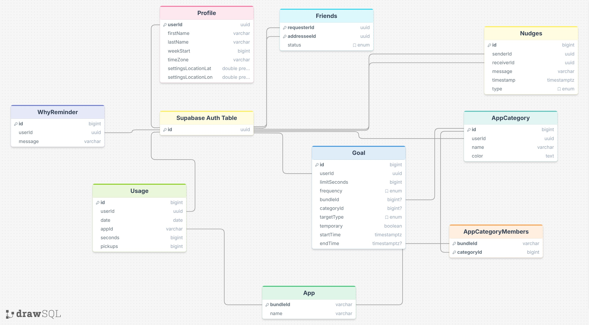

# Project Report

## Project Summary

### Nudge - Beating Screen Time Through Accountability
Nudge is a screen time iPhone iOS app that tracks your screen time and sends texts to your friends when you've been on your phone for too long. The main difference between this and other screen time apps is that this seeks not to block or inhibit you, but to just remind you and help motivate you to be better. You can set goals in the app for specific apps, or for total time, and you and your friends will get texts throughout the day as you use your phone to let you know if you've strayed off track.

---

## Project Design

Nudge is built using SwiftUI on the frontend and Supbase on the backend. Text messages are sent to users and friends using Twilio. When an event happens that would cause a messsage to be sent, that event calls an edge function in Supabase, which in turn communicates with Twilio to facilitate message sending. Here is how data is modeled in Supabase's PostrgreSQL:

---

## Demo Video

<video src="../demoVideo.MP4" controls width="100%"></video>

---

## What Did I Learn?

I learned a ton of new things through this project, both about specific technologies, as well as the development process in general. Here are a couple things that really stuck out to me:
 - It takes a long time to set up infrastructure for a project like this. Even after designing, I had to spend a lot of time setting up Apple Developer Permissions, appliying for the capabilities to use in my app, setting up Twilio and getting authenticated there...At least half of the time I spent on this project was just in setting up systems, as opposed to actually 'developing'.
 - SwiftUI & XCode - this was an entirely new framework/IDE for me, and I learned a lot about the capabilities of the language. It's set up in a super convenient way to enable testing both on simulators as well as my real device, which was incredibly helpful
 - Claude-driven development. This was the first project I've built using Claude as the primary developer. I learned how important spec files and the planning process are. I had to redo my documentation many times and restructure it to get it to be in a way that Claude sessions could effectively read, process, and develop.
 - I learned about Supabase's functionalities a lot more. It is really convenient for backend development, especially for integrating with other services through edge functions and such.

---

## Does the Project Integrate with AI?

No. It is possible that I implement AI features in the future, such as helping to analyze historical data and personalize messages to send to friends and users, but those are not planned features as of now. 

---

## How Did I Use AI to Build My Project?

I used Claude extensively in the development process. I had no experience building Native mobile apps, so it helped me with a lot of architecturing. I created a rough plan of what I wanted to implement, and then I would have planning sessions with Claude to create specs and make architecture decisions for how the App would be constructed. You can check out a lot of that in the [docs folder](../docs/). Claude did basically all of the actual code writing while I handled the setup off the app and services that were used.

---

## Why This Project Is Interesting to Me

Having less screen time has long been a goal I have worked on. I have learned a lot about what actually motivates and inspires lasting change and I have found that when there is some restriction/block, it just becomes a game of how to beat that restriction. What truly breeds change is tracking behavior and having people to help you with that behavior. We thrive off of connection as people, so I hope that the reminder of connection will help people remember to engage with the real world and less with the virtual, myself included. I also think this can be extremely helpful for parents to be informed of their kids screen time use in real time.

---

## Failover Strategy, Scaling, Performance, Authentication, and Concurrency

**Failover Strategy:** I'm currently fully reliant on managed services (Supabase, Twilio). There's no custom failover logic, but Supabase has built-in redundancy at the infrastructure level. If Twilio fails, messages silently drop — this is something that eventually needs to be handled with better updates and perhaps queueing messages and retrying when failures occur.

**Scaling:** Scaling on the backend is handled fairly well with Supabase. Edge Functions are serverless and scale automatically with load The bottleneck would likely be with Twilio. As it expands, I would need to purchase more numbers to be able to handle all the messages at once.

**Performance:** Screen time data is collected locally on-device via Apple's DeviceActivity framework and only synced to Supabase periodically. This means the app doesn't hammer the network constantly. Rather, the heavy lifting happens natively on device. One performance bottleneck to figure out is the delay between a user reaching a Nudge trigger event and that message actually getting sent. There may be some limitations but this remains to be seen as we did not get that far in development.

**Authentication:** Authentication is handled through Supabase. Users can authenticate with email/password or AppleID. The Supabase auth table and its ids forms the basis for all the other tables and data that is stored and accessed. Users can have multiple devices with the same account, making cross-device functionality easy.

**Concurrency:** The app has two separate processes: the main Nudge app and the NudgeActivityMonitor extension. They run independently and share data via App Groups. Inside the app, Swift's async/await handles all network calls off the main thread so the UI stays responsive. I have not implemented any locking or mutexes on any data stored.

---

## Class Channel Post

[Here](https://teams.microsoft.com/l/message/19:01986f3a1f6a4ece8d64bb40d89bf09d@thread.tacv2/1776268470716?tenantId=c6fc6e9b-51fb-48a8-b779-9ee564b40413&groupId=5d8ddfcb-a9e8-4785-b9d1-c4579b243975&parentMessageId=1776268470716&teamName=CS%20452%20(Winter%202026)&channelName=Report%20-%20Final%20Project&createdTime=1776268470716) is a link to my post in the class channel.

---

## Sharing Permission

No, don't share. 
